# nanobot redux: Ultra-Lightweight Personal AI Assistant


[](https://github.com/Athemis/nanobot-redux/actions/workflows/tests.yml)

🐈 **nanobot-redux** is an **ultra-lightweight** personal AI assistant inspired by [OpenClaw](https://github.com/openclaw/openclaw). It is an opinionated fork of [**nanobot**](https://github.com/HKUDS/nanobot) by HKUDS.
> All credit for the original project goes to the HKUDS team and contributors.

⚡️ Delivers core agent functionality in just **~4,000** lines of code — **99% smaller** than Clawdbot's 430k+ lines.

📏 Real-time line count: **3,851 lines** (run `bash core_agent_lines.sh` to verify anytime)

## 📍 Fork Baseline

This fork is based on **[HKUDS/nanobot v0.1.3.post7](https://github.com/HKUDS/nanobot/releases/tag/v0.1.3.post7)** which includes:
- MCP (Model Context Protocol) support
- Security hardening and multiple improvements
- Matrix channel, OpenAI Codex OAuth, multi-provider web search (including SearXNG)
- Enhanced tool safety (`delete_file` symlink protection, shell security hardening)

## Key Features of nanobot:

🪶 **Ultra-Lightweight**: Just ~4,000 lines of core agent code — 99% smaller than Clawdbot.

🔬 **Research-Ready**: Clean, readable code that's easy to understand, modify, and extend for research.

⚡️ **Lightning Fast**: Minimal footprint means faster startup, lower resource usage, and quicker iterations.

💎 **Easy-to-Use**: One-click to deploy and you're ready to go.

## 🏗️ Architecture




## ✨ Features

- 🔍 **Web Search** - Multi-provider support (Brave, Tavily, SearXNG, DuckDuckGo)
- 🔌 **MCP Integration** - Model Context Protocol for extensible tools
- 💬 **Multiple Channels** - Matrix (Element) and Email support
- 🤖 **Multi-Provider LLMs** - OpenRouter, OpenAI, Anthropic, custom endpoints, vLLM
- 📝 **File Operations** - Read, write, edit with workspace safety controls
- 🌐 **Shell Commands** - Controlled execution with security hardening
- 📅 **Cron Scheduling** - Natural language task scheduling
- 🧠 **Memory System** - Persistent context and knowledge retention
- 🔒 **Security First** - Workspace restrictions, symlink protection, shell validation

## 📦 Install

**Install from source** (latest features, recommended for development)

```bash
git clone https://github.com/Athemis/nanobot-redux.git
cd nanobot-redux
pip install -e .
```

**Install with [uv](https://github.com/astral-sh/uv)** (stable, fast)

```bash
uv tool install nanobot-ai
```

**Install from PyPI** (stable)

```bash
pip install nanobot-ai
```

## 🚀 Quick Start

> [!TIP]
> Set your API key in `~/.nanobot/config.json`.
> Get API keys: [OpenRouter](https://openrouter.ai/keys) (Global) · [DashScope](https://dashscope.console.aliyun.com) (Qwen) · [Brave Search](https://brave.com/search/api/) or [Tavily](https://tavily.com/) (optional, for web search). SearXNG is supported via a base URL.

**1. Initialize**

```bash
nanobot onboard
```

**2. Configure** (`~/.nanobot/config.json`)

Add or merge these **two parts** into your config (other options have defaults).

*Set your API key* (e.g. OpenRouter, recommended for global users):
```json
{
  "providers": {
    "openrouter": {
      "apiKey": "sk-or-v1-xxx"
    }
  }
}
```

*Set your model*:
```json
{
  "agents": {
    "defaults": {
      "model": "anthropic/claude-opus-4-5"
    }
  }
}
```

`nanobot onboard` seeds OpenRouter attribution headers by default; set `providers.openrouter.extraHeaders` to `{}` to opt out.
**Optional: Web search provider** — set `tools.web.search.provider` to `brave` (default), `duckduckgo`, `tavily`, or `searxng`. See [docs/web-search.md](docs/web-search.md) for full configuration.

```json
{
  "tools": {
    "web": {
      "search": {
        "provider": "tavily",
        "apiKey": "tvly-..."
      }
    }
  }
}
```

**3. Chat**

```bash
nanobot agent
```

That's it! You have a working AI assistant in 2 minutes.

## 💬 Chat Apps

Talk to your nanobot through Matrix (Element) or Email — anytime, anywhere.

| Channel              | Setup                              |
| -------------------- | ---------------------------------- |
| **Matrix (Element)** | Medium (homeserver + access token) |
| **Email**            | Medium (IMAP/SMTP credentials)     |

<details>
<summary><b>Matrix (Element)</b></summary>

Uses Matrix sync via `matrix-nio` (inbound media + outbound file attachments).

**1. Create/choose a Matrix account**

- Create or reuse a Matrix account on your homeserver (for example `matrix.org`).
- Confirm you can log in with Element.

**2. Get credentials**

- You need:
  - `userId` (example: `@nanobot:matrix.org`)
  - `accessToken`
  - `deviceId` (recommended so sync tokens can be restored across restarts)
- You can obtain these from your homeserver login API (`/_matrix/client/v3/login`) or from your client's advanced session settings.

**3. Configure**

```json
{
  "channels": {
    "matrix": {
      "enabled": true,
      "homeserver": "https://matrix.org",
      "userId": "@nanobot:matrix.org",
      "accessToken": "syt_xxx",
      "deviceId": "NANOBOT01",
      "e2eeEnabled": true,
      "allowFrom": [],
      "groupPolicy": "open",
      "groupAllowFrom": [],
      "allowRoomMentions": false,
      "maxMediaBytes": 20971520
    }
  }
}
```

> `allowFrom`: Empty allows all senders; set user IDs to restrict access.
> `groupPolicy`: `open`, `mention`, or `allowlist`.
> `groupAllowFrom`: Room allowlist used when `groupPolicy` is `allowlist`.
> `allowRoomMentions`: If `true`, accepts `@room` (`m.mentions.room`) in mention mode.
> `e2eeEnabled`: Enables Matrix E2EE support (default `true`); set `false` only for plaintext-only setups.
> `maxMediaBytes`: Max attachment size in bytes (default `20MB`) for inbound and outbound media handling; set to `0` to block all inbound and outbound attachment uploads.

> [!NOTE]
> Matrix E2EE implications:
>
> - Keep a persistent `matrix-store` and stable `deviceId`; otherwise encrypted session state can be lost after restart.
> - In newly joined encrypted rooms, initial messages may fail until Olm/Megolm sessions are established.
> - With `e2eeEnabled=false`, encrypted room messages may be undecryptable and E2EE send safeguards are not applied.
> - With `e2eeEnabled=true`, the bot sends with `ignore_unverified_devices=true` (more compatible, less strict than verified-only sending).
> - Changing `accessToken`/`deviceId` effectively creates a new device and may require session re-establishment.
> - Outbound attachments are sent from `OutboundMessage.media`.
> - Effective media limit (inbound + outbound) uses the stricter value of local `maxMediaBytes` and homeserver `m.upload.size` (if advertised).
> - If `tools.restrictToWorkspace=true`, Matrix outbound attachments are limited to files inside the workspace.

**4. Run**

```bash
nanobot gateway
```

</details>

<details>
<summary><b>Email</b></summary>

Give nanobot its own email account. It polls **IMAP** for incoming mail and replies via **SMTP** — like a personal email assistant.

**1. Get credentials (Gmail example)**
- Create a dedicated Gmail account for your bot (e.g. `my-nanobot@gmail.com`)
- Enable 2-Step Verification → Create an [App Password](https://myaccount.google.com/apppasswords)
- Use this app password for both IMAP and SMTP

**2. Configure**

> - `consentGranted` must be `true` to allow mailbox access. This is a safety gate — set `false` to fully disable.
> - `allowFrom`: Leave empty to accept emails from anyone, or restrict to specific senders.
> - `smtpUseTls` and `smtpUseSsl` default to `true` / `false` respectively, which is correct for Gmail (port 587 + STARTTLS). No need to set them explicitly.
> - At least one of `smtpUseTls` or `smtpUseSsl` must be enabled. nanobot refuses plaintext SMTP sends if both are `false`.
> - `tlsVerify` defaults to `true` and should stay enabled. Set `false` only for trusted edge cases (for example corporate TLS interception with controlled network path).
> - Set `"autoReplyEnabled": false` if you only want to read/analyze emails without sending automatic replies.

```json
{
  "channels": {
    "email": {
      "enabled": true,
      "consentGranted": true,
      "imapHost": "imap.gmail.com",
      "imapPort": 993,
      "imapUsername": "my-nanobot@gmail.com",
      "imapPassword": "your-app-password",
      "smtpHost": "smtp.gmail.com",
      "smtpPort": 587,
      "smtpUsername": "my-nanobot@gmail.com",
      "smtpPassword": "your-app-password",
      "tlsVerify": true,
      "fromAddress": "my-nanobot@gmail.com",
      "allowFrom": ["your-real-email@gmail.com"]
    }
  }
}
```


**3. Run**

```bash
nanobot gateway
```

</details>

## ⚙️ Configuration

Config file: `~/.nanobot/config.json`

### Providers

> [!TIP]
>
> - **Groq** provides free voice transcription via Whisper.
> - **Zhipu Coding Plan**: If you're on Zhipu's coding plan, set `"apiBase": "https://open.bigmodel.cn/api/coding/paas/v4"` in your zhipu provider config.
> - **MiniMax (Mainland China)**: If your API key is from MiniMax's mainland China platform (minimaxi.com), set `"apiBase": "https://api.minimaxi.com/v1"` in your minimax provider config.

| Provider | Purpose | Get API Key |
|----------|---------|-------------|
| `custom` | Any OpenAI-compatible endpoint | — |
| `openrouter` | LLM (recommended, access to all models) | [openrouter.ai](https://openrouter.ai) |
| `anthropic` | LLM (Claude direct) | [console.anthropic.com](https://console.anthropic.com) |
| `openai` | LLM (GPT direct) | [platform.openai.com](https://platform.openai.com) |
| `deepseek` | LLM (DeepSeek direct) | [platform.deepseek.com](https://platform.deepseek.com) |
| `groq` | LLM + **Voice transcription** (Whisper) | [console.groq.com](https://console.groq.com) |
| `gemini` | LLM (Gemini direct) | [aistudio.google.com](https://aistudio.google.com) |
| `minimax` | LLM (MiniMax direct) | [platform.minimax.io](https://platform.minimax.io) |
| `aihubmix` | LLM (API gateway, access to all models) | [aihubmix.com](https://aihubmix.com) |
| `dashscope` | LLM (Qwen) | [dashscope.console.aliyun.com](https://dashscope.console.aliyun.com) |
| `moonshot` | LLM (Moonshot/Kimi) | [platform.moonshot.cn](https://platform.moonshot.cn) |
| `zhipu` | LLM (Zhipu GLM) | [open.bigmodel.cn](https://open.bigmodel.cn) |
| `vllm` | LLM (local, any OpenAI-compatible server) | — |
| `openai_codex` | LLM (Codex, OAuth) | `nanobot provider login openai-codex` |

<details>
<summary><b>OpenAI Codex (OAuth)</b></summary>

Codex uses OAuth instead of API keys. Requires a ChatGPT Plus or Pro account.

**1. Login:**
```bash
nanobot provider login openai-codex
```

**2. Set model** (merge into `~/.nanobot/config.json`):
```json
{
  "agents": {
    "defaults": {
      "model": "openai-codex/gpt-5.2-codex"
    }
  }
}
```

**3. Chat:**
```bash
nanobot agent -m "Hello!"
```

**Optional (corp proxy/VPN only): disable TLS cert verification explicitly**
```json
{
  "providers": {
    "openaiCodex": {
      "sslVerify": false
    }
  }
}
```
Use this **only when you trust your network** path. Disabling verification increases **MITM risk** and can expose your OAuth bearer token.

> Docker users: use `docker run -it` for interactive OAuth login.

</details>

<details>
<summary><b>Custom Provider (Any OpenAI-compatible API)</b></summary>

If your provider is not listed above but exposes an **OpenAI-compatible API** (e.g. Together AI, Fireworks, Azure OpenAI, self-hosted endpoints), use the `custom` provider:

```json
{
  "providers": {
    "custom": {
      "apiKey": "your-api-key",
      "apiBase": "https://api.your-provider.com/v1"
    }
  },
  "agents": {
    "defaults": {
      "model": "your-model-name"
    }
  }
}
```

> The `custom` provider routes through LiteLLM's OpenAI-compatible path. It works with any endpoint that follows the OpenAI chat completions API format. The model name is passed directly to the endpoint without any prefix.

</details>

<details>
<summary><b>vLLM (local / OpenAI-compatible)</b></summary>

Run your own model with vLLM or any OpenAI-compatible server, then add to config:

**1. Start the server** (example):
```bash
vllm serve meta-llama/Llama-3.1-8B-Instruct --port 8000
```

**2. Add to config** (partial — merge into `~/.nanobot/config.json`):

*Provider (key can be any non-empty string for local):*
```json
{
  "providers": {
    "vllm": {
      "apiKey": "dummy",
      "apiBase": "http://localhost:8000/v1"
    }
  }
}
```

*Model:*
```json
{
  "agents": {
    "defaults": {
      "model": "meta-llama/Llama-3.1-8B-Instruct"
    }
  }
}
```

</details>

<details>
<summary><b>Adding a New Provider (Developer Guide)</b></summary>

nanobot uses a **Provider Registry** (`nanobot/providers/registry.py`) as the single source of truth.
Adding a new provider only takes **2 steps** — no if-elif chains to touch.

**Step 1.** Add a `ProviderSpec` entry to `PROVIDERS` in `nanobot/providers/registry.py`:

```python
ProviderSpec(
    name="myprovider",                   # config field name
    keywords=("myprovider", "mymodel"),  # model-name keywords for auto-matching
    env_key="MYPROVIDER_API_KEY",        # env var for LiteLLM
    display_name="My Provider",          # shown in `nanobot status`
    litellm_prefix="myprovider",         # auto-prefix: model → myprovider/model
    skip_prefixes=("myprovider/",),      # don't double-prefix
)
```

**Step 2.** Add a field to `ProvidersConfig` in `nanobot/config/schema.py`:

```python
class ProvidersConfig(BaseModel):
    ...
    myprovider: ProviderConfig = ProviderConfig()
```

That's it! Environment variables, model prefixing, config matching, and `nanobot status` display will all work automatically.

**Common `ProviderSpec` options:**

| Field                    | Description                                     | Example                                  |
| ------------------------ | ----------------------------------------------- | ---------------------------------------- |
| `litellm_prefix`         | Auto-prefix model names for LiteLLM             | `"dashscope"` → `dashscope/qwen-max`     |
| `skip_prefixes`          | Don't prefix if model already starts with these | `("dashscope/", "openrouter/")`          |
| `env_extras`             | Additional env vars to set                      | `(("ZHIPUAI_API_KEY", "{api_key}"),)`    |
| `model_overrides`        | Per-model parameter overrides                   | `(("kimi-k2.5", {"temperature": 1.0}),)` |
| `is_gateway`             | Can route any model (like OpenRouter)           | `True`                                   |
| `detect_by_key_prefix`   | Detect gateway by API key prefix                | `"sk-or-"`                               |
| `detect_by_base_keyword` | Detect gateway by API base URL                  | `"openrouter"`                           |
| `strip_model_prefix`     | Strip existing prefix before re-prefixing       | `True` (for AiHubMix)                    |

</details>


### MCP (Model Context Protocol)

> [!TIP]
> The config format is compatible with Claude Desktop / Cursor. You can copy MCP server configs directly from any MCP server's README.

nanobot supports [MCP](https://modelcontextprotocol.io/) — connect external tool servers and use them as native agent tools.

Add MCP servers to your `config.json`:

```json
{
  "tools": {
    "mcpServers": {
      "filesystem": {
        "command": "npx",
        "args": ["-y", "@modelcontextprotocol/server-filesystem", "/path/to/dir"]
      }
    }
  }
}
```

Two transport modes are supported:

| Mode | Config | Example |
|------|--------|---------|
| **Stdio** | `command` + `args` | Local process via `npx` / `uvx` |
| **HTTP** | `url` | Remote endpoint (`https://mcp.example.com/sse`) |

MCP tools are automatically discovered and registered on startup. The LLM can use them alongside built-in tools — no extra configuration needed.


### Security

> [!TIP]
> For production deployments, set `"restrictToWorkspace": true` in your config to sandbox the agent.

| Option                      | Default          | Description                                                                                                                                                 |
| --------------------------- | ---------------- | ----------------------------------------------------------------------------------------------------------------------------------------------------------- |
| `tools.restrictToWorkspace` | `false`          | When `true`, restricts **all** agent tools (shell, file read/write/edit, list) to the workspace directory. Prevents path traversal and out-of-scope access. |
| `channels.*.allowFrom`      | `[]` (allow all) | Whitelist of user IDs. Empty = allow everyone; non-empty = only listed users can interact.                                                                  |

## CLI Reference

| Command                               | Description                   |
| ------------------------------------- | ----------------------------- |
| `nanobot onboard`                     | Initialize config & workspace |
| `nanobot agent -m "..."`              | Chat with the agent           |
| `nanobot agent`                       | Interactive chat mode         |
| `nanobot agent --no-markdown`         | Show plain-text replies       |
| `nanobot agent --logs`                | Show runtime logs during chat |
| `nanobot gateway`                     | Start the gateway             |
| `nanobot status`                      | Show status                   |
| `nanobot provider login openai-codex` | OAuth login for providers     |
| `nanobot channels status`             | Show channel status           |

Interactive mode exits: `exit`, `quit`, `/exit`, `/quit`, `:q`, or `Ctrl+D`.

<details>
<summary><b>Scheduled Tasks (Cron)</b></summary>

```bash
# Add a recurring job (cron expression)
nanobot cron add --name "daily" --message "Good morning!" --cron "0 9 * * *"

# Add a timezone-aware job (IANA timezone)
nanobot cron add --name "daily-berlin" --message "Good morning!" --cron "0 9 * * *" --tz "Europe/Berlin"

# Add an interval job
nanobot cron add --name "hourly" --message "Check status" --every 3600

# Add a one-time reminder
nanobot cron add --name "meeting" --message "Meeting now!" --at "2099-01-01T15:00:00"

# List jobs
nanobot cron list

# Remove a job
nanobot cron remove <job_id>
```

> Jobs added via `nanobot cron add` while the gateway is running are picked up automatically within ≤5 minutes (mtime polling, no restart required).

</details>

## 🐳 Docker

> [!TIP]
> The `-v ~/.nanobot:/root/.nanobot` flag mounts your local config directory into the container, so your config and workspace persist across container restarts.
>
> The default `Dockerfile` uses a multi-stage Alpine build (`python:3.14-alpine`) and includes Matrix E2EE dependencies (`olm`, `olm-dev`). It also sets `CMAKE_POLICY_VERSION_MINIMUM=3.5` to keep `python-olm` builds working with Alpine 3.23's CMake 4.

Build and run nanobot in a container:

```bash
# Build the image
docker build -t nanobot .

# Initialize config (first time only)
docker run -v ~/.nanobot:/root/.nanobot --rm nanobot onboard

# Edit config on host to add API keys
vim ~/.nanobot/config.json

# Run gateway (connects to enabled channels, e.g. Matrix/Email)
docker run -v ~/.nanobot:/root/.nanobot -p 18790:18790 nanobot gateway

# Or run a single command
docker run -v ~/.nanobot:/root/.nanobot --rm nanobot agent -m "Hello!"
docker run -v ~/.nanobot:/root/.nanobot --rm nanobot status
```

## 📁 Project Structure

```
nanobot/
├── agent/          # 🧠 Core agent logic
│   ├── loop.py     #    Agent loop (LLM ↔ tool execution)
│   ├── context.py  #    Prompt builder
│   ├── memory.py   #    Persistent memory
│   ├── skills.py   #    Skills loader
│   ├── subagent.py #    Background task execution
│   └── tools/      #    Built-in tools (incl. spawn)
├── skills/         # 🎯 Bundled skills (github, weather, tmux...)
├── channels/       # 📱 Chat channel integrations
├── bus/            # 🚌 Message routing
├── cron/           # ⏰ Scheduled tasks
├── heartbeat/      # 💓 Proactive wake-up
├── providers/      # 🤖 LLM providers (OpenRouter, etc.)
├── session/        # 💬 Conversation sessions
├── config/         # ⚙️ Configuration
└── cli/            # 🖥️ Commands
```

## 🧭 About This Fork (nanobot redux)

**nanobot redux** is an **opinionated fork** of nanobot, maintained for my personal needs and workflows. I adopt upstream changes selectively and focus on features I can actually use and test.

### What Stays Stable

I try to keep these compatible so I don't break my own setup:

- CLI stays `nanobot`
- Python package stays `nanobot.*`
- Config lives in `~/.nanobot/*`

### What This Fork Adds

Changes that are specific to this fork and not in upstream:

**⏰ Cron scheduler**
- Hot-reload: jobs added via `nanobot cron add` while the gateway runs are picked up within ≤5 minutes — no restart needed ([#22](https://github.com/Athemis/nanobot-redux/pull/22))
- Cron loop is resilient to disk errors — `OSError` in `_save_store` no longer kills the timer task permanently ([#22](https://github.com/Athemis/nanobot-redux/pull/22))

**🔒 Security hardening**
- Codex provider: TLS verification is on by default; `sslVerify=false` must be set explicitly, preventing silent MITM exposure on corporate proxies
- Codex provider: SSE error payloads (`error`, `response.failed`) are surfaced as diagnostic messages instead of generic failure text
- Codex provider: `max_output_tokens`/`max_tokens` omitted from OAuth payloads (the endpoint rejects them — fixes actual API failures)
- Email channel: plaintext SMTP (both `smtpUseTls` and `smtpUseSsl` disabled) is refused at send time; `tlsVerify` defaults to `true` with explicit opt-out

**🤖 Agent reliability**
- Subagent skill access: built-in skills are always readable even when `tools.restrictToWorkspace=true` — previously subagents silently lost access to all skills in restricted mode

### Philosophy

- Keep channels stable, debuggable, and easy to self-host
- Make sure providers work in real-world scenarios (local, VPN, corporate networks)
- Treat web search as configurable plumbing—local and federated options matter
- Only build tools I actually use regularly and want to support
- Add safety guards on anything that touches sensitive files or runs commands

### Contributions

Contributions are welcome! However, I'll only integrate features that I can personally use or at least test myself. For example, I won't add support for obscure chat platforms I can't validate. If you need something I can't test, feel free to maintain your own fork.

### Version & Release Info

- Separate version line from upstream (starting at `0.2.0`)
- I release when things feel stable, no fixed schedule
- Upstream changes are adopted selectively based on my needs

For technical details on upstream intake, adoption criteria, and release process:

- [`docs/redux-manifest.md`](docs/redux-manifest.md) - Fork philosophy and priorities
- [`docs/upstream-intake.md`](docs/upstream-intake.md) - How I evaluate upstream changes
- [`docs/upstream-log.md`](docs/upstream-log.md) - Upstream adoptions, deferrals, and rejections
- [`docs/redux-changes.md`](docs/redux-changes.md) - Changes originating in this fork
- [`docs/release-template.md`](docs/release-template.md) - Release checklist

## 🤝 Contributing

Contributions are welcome! Please read [CONTRIBUTING.md](CONTRIBUTING.md) for guidelines on:

- Development setup and testing
- Coding style and conventions
- Commit message format
- Pull request process
- What kinds of contributions are likely to be accepted

## 📄 License

MIT License - see [LICENSE](LICENSE) for details.
